  
  &nbsp;
  

---

I'm a Product & Solutions Analyst who brings clarity to complex operations. I evaluate systems, uncover hidden opportunities and turn business challenges into elegant solutions grounded in data.

Building on that foundation, I'm now expanding my expertise into **Data Engineering & AI**, designing the kind of infrastructure that makes information reliable, scalable and ready for smarter decisions. My goal is to bridge business vision and solid engineering, delivering pipelines and insights that generate lasting value for the organizations I work with.

---

### Languages & Tools

---

### Projects

---

### Activity

